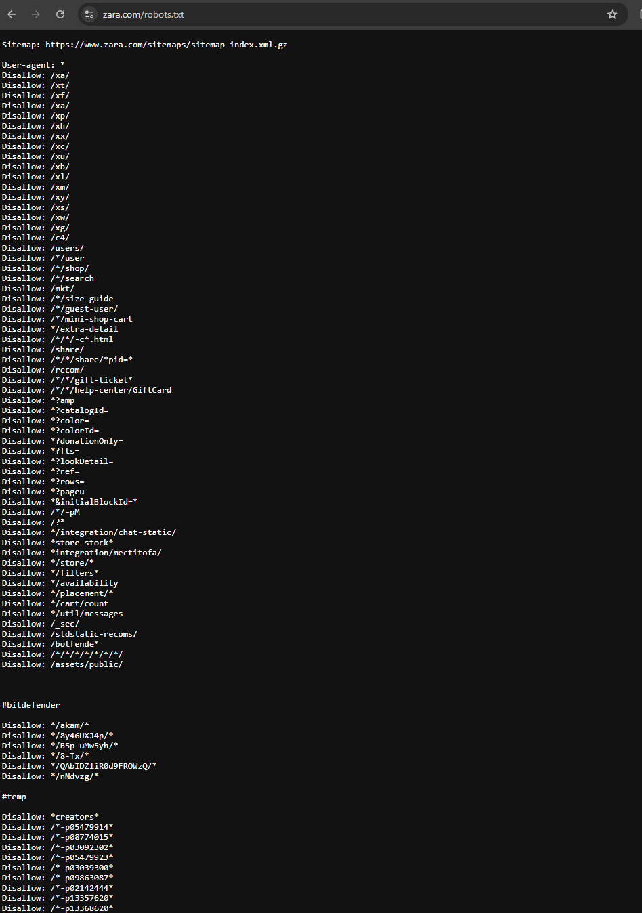
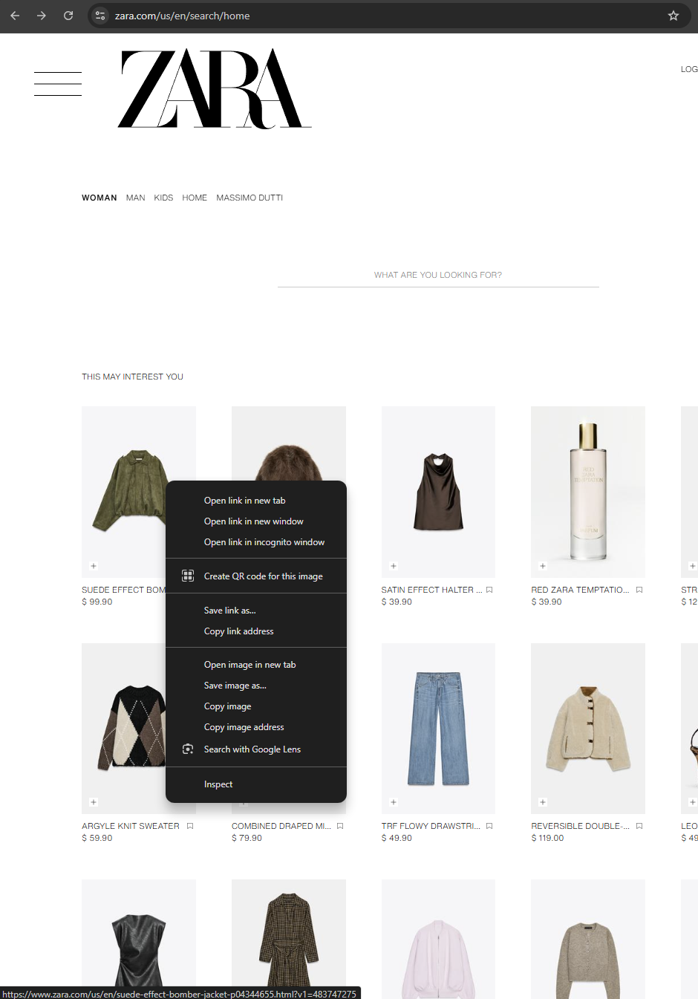
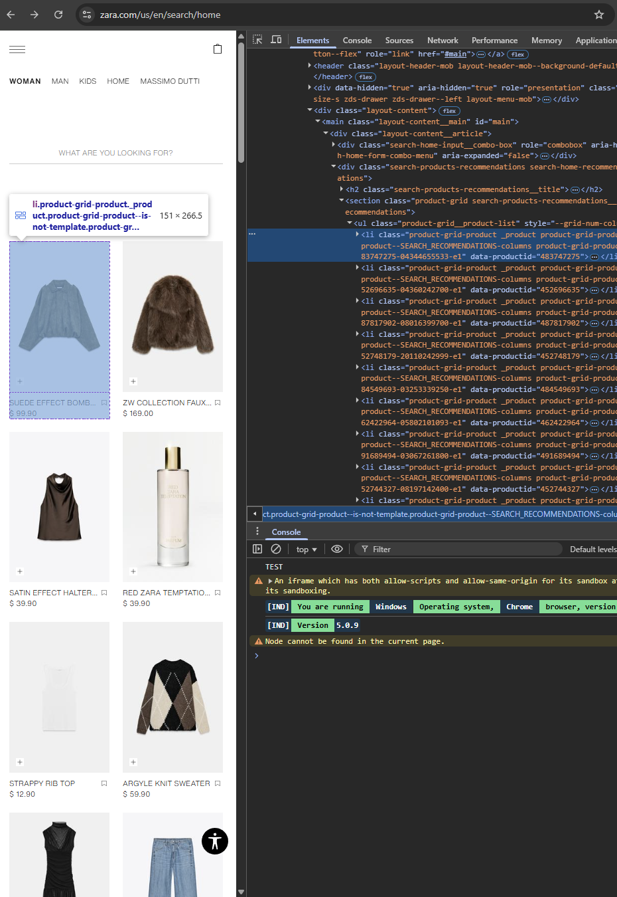

# HTML Inspection & Web Scraping Guide
This tutorial will walk you through basic principles of HTML inspection neccessary for web crawling and data extraction.
Estimated time: 5 mins

## Cell-Based Listings
Most e-commerce listing data is organized in a nested, cell-based HTML structure. Each parent cell represents a single product listing and contains elements such as the title, an image, and the price.

### What About an API?

Some retailers provide APIs for accessing their data. However, these APIs may require authorization, impose usage limits, or not be publicly accessible. 

If an API is unavailable or unsuitable, web scraping can be a viable alternative. Before proceeding, always check the site's `robots.txt` file to ensure compliance with the site's rules.
### 0. Can I Crawl This Site?

Before starting any web scraping, it's important to check the site's `robots.txt` file to understand the rules set by the site owner. This file specifies which parts of the site can be accessed by automated agents.

#### Steps to Check `robots.txt`:
1. Open your browser and navigate to the website's root URL.
2. Append `/robots.txt` to the URL. For example:
    - `https://www.example.com/robots.txt`
3. Review the file to see if your target pages are allowed for crawling.

#### Example `robots.txt` File:
```txt
User-agent: *
Disallow: /private/
Allow: /public/
```

- **`User-agent`**: Specifies which bots the rules apply to (`*` means all bots).
- **`Disallow`**: Lists paths that are off-limits for bots.
- **`Allow`**: Lists paths that bots are permitted to access.

#### Key Points:
- If the `robots.txt` file disallows your target pages, do not scrape them.
- Always respect the site's rules to avoid legal or ethical issues.

### 1. Find and Select a Cell
- Go to any e-commerce site (Amazon, eBay, etc.)
- Navigate to a category page with multiple products
- **Right-click directly on ONE PRODUCT CELL** → "Inspect Element"

### 2. Get the Cell's Class Name
When you right-click on a product cell, you'll see something like:

```html
<div class="product-card">          ← This is the CELL with class="product-card"
    
    <h3>Product Name</h3>
    <span class="price">$19.99</span>
    <p>Product description...</p>
</div>
```

**Key Step**: Note the class name of the cell (e.g., `"product-card"`)

### 3. Find All Similar Cells
Use the class name to get all product cells on the page:

```python
# Find all cells with the same class
cells = soup.find_all('div', class_='product-card')

print(f"Found {len(cells)} product cells!")
```

### 4. Extract Data from Each Cell
For each cell, search inside it for the data you need:

```python
for cell in cells:
    # Search INSIDE each cell for data
    title = cell.find('h3').text if cell.find('h3') else "No title"
    price = cell.find('span', class_='price').text if cell.find('span', class_='price') else "No price"
    # etc...
```

## Debugging Your Cell Scraper

### Step 1: Check if you found any cells
```python
cells = soup.find_all('div', class_='product-card')
print(f"Found {len(cells)} cells")

if len(cells) == 0:
    print("No cells found. Check your class name.")
```

### Step 2: Look at the first cell's HTML
```python
if cells:
    print("First cell HTML:")
    print(cells[0].prettify())  # See what's actually inside the cell
```

### Step 3: Test extracting from one cell
```python
if cells:
    first_cell = cells[0]
    
    # Try to find title
    title_element = first_cell.find('h3')
    if title_element:
        print(f"Title found: {title_element.text}")
    else:
        print("No h3 title found in this cell")
    
    # Try to find price
    price_element = first_cell.find('span', class_='price')
    if price_element:
        print(f"Price found: {price_element.text}")
    else:
        print("No price span found in this cell")
```

### Step 4: Test in browser console
```javascript
// Test in browser developer tools console
document.querySelectorAll('.product-card')     // Find all cells with that class
document.querySelectorAll('.product-card')[0]   // Look at first cell
```

## 🎓 Step-by-Step Exercise

### Step 1: Pick Your Target Site
Choose any e-commerce site with product listings:
- eBay, Amazon, Etsy, etc.
- Local retailer websites
- Online marketplaces

### Step 2: Check robots.txt
Before scraping, check if it's allowed:
1. Go to `yoursite.com/robots.txt`
2. Look for `Disallow` rules that might block your target pages
3. Only proceed if scraping is permitted



*Example: Checking Zara's robots.txt file*

### Step 3: Find a Listings Page
Navigate to a page with multiple products:
- Category pages (e.g., "Electronics", "Books")
- Search results pages
- Homepage product grids

### Step 4: Inspect Element
1. **Right-click on ONE product listing** → "Inspect Element"
2. Find the HTML container that wraps the entire product
3. **Look for the class name** (e.g., `class="product-item"`)



*Example: Right-clicking on a Zara product to inspect the HTML*



*Example: Locating the product container class name in the HTML*

### Step 5: Update Your Code
Open `example_scraper.py` and:
1. Change the `url` to your target site
2. Replace `"product-card"` with your actual class name
3. Run the script to see how many cells it finds

### Step 6: Feature Extraction (Next Step)
Once you can find all the cells, you'll customize the selectors to extract:
- Product titles
- Prices  
- Images
- Any other data you need

**The `example_scraper.py` file is your template - modify it for your chosen site**

---